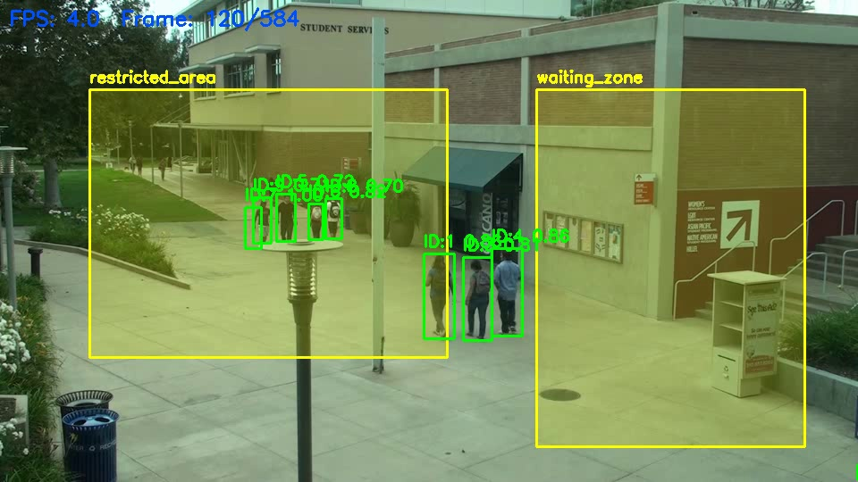
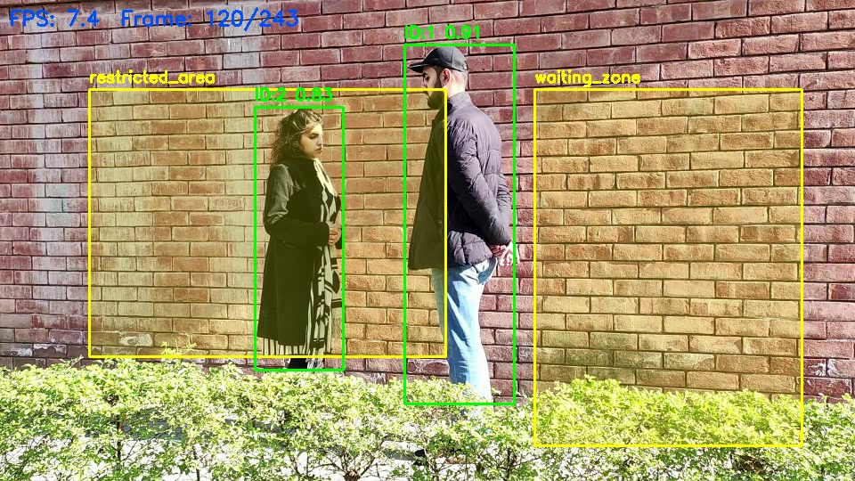
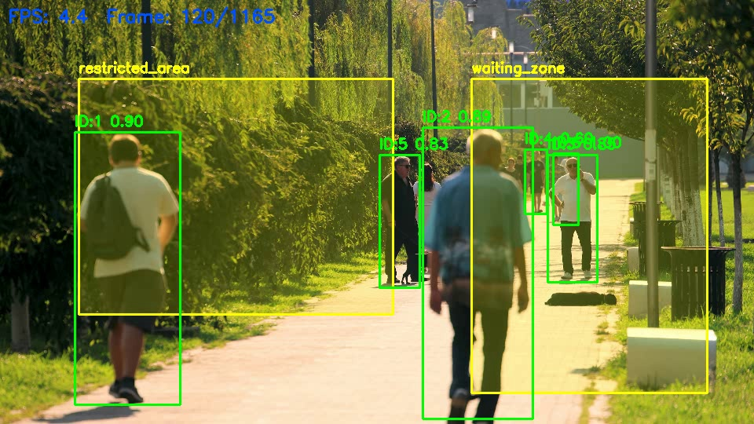

# AI-ZoneWatch — Video Surveillance: Detection, Tracking & Event Recognition

A production-ready prototype that processes security camera footage to **detect people**, **track them across frames**, and **identify zone-based events** (intrusion & loitering).

---

## Architecture Overview

```
┌─────────────┐     ┌──────────────────┐     ┌────────────────┐
│  Input Video│────▶│  PersonDetector  │────▶│    Tracker     │
│  (any MP4)  │     │  (YOLOv8n/s/m)  │     │  (DeepSORT)    │
└─────────────┘     └──────────────────┘     └───────┬────────┘
                                                      │ tracks [{id, bbox, conf}]
                    ┌──────────────────┐              │
                    │   ZoneManager    │◀─────────────┘
                    │  (Shapely PIP)   │
                    └───────┬──────────┘
                            │ matched_zones per track
                    ┌───────▼──────────┐
                    │  EventManager    │
                    │  intrusion /     │
                    │  loitering       │
                    └───────┬──────────┘
                            │
              ┌─────────────┴─────────────┐
              ▼                           ▼
    annotated.mp4                events.csv / events.json
```

**Pipeline stages** (clean separation of concerns):

| Module | Responsibility |
|--------|---------------|
| `core/detector.py` | YOLOv8 inference, person-class filtering, confidence thresholding |
| `core/tracker.py` | DeepSORT update, confirmed-track filtering, confidence passthrough |
| `core/zone_manager.py` | Load polygon zones from JSON, point-in-polygon (Shapely) |
| `core/event_manager.py` | Entry/exit state, intrusion deduplication, stationary loitering logic, CSV+JSON output |
| `core/video_processor.py` | Frame iteration, optional stride, real-time FPS, annotated writer |
| `core/utils.py` | Drawing helpers (zones, tracks, events, FPS overlay) |
| `run.py` | CLI entry-point, pipeline orchestration |

---

## Model Choices

### Detection — YOLOv8n (Ultralytics)
- **Why YOLOv8**: Single-stage detector; excellent speed/accuracy trade-off for surveillance. Pre-trained on COCO (person class = 0).
- **Why `n` (nano) by default**: Runs at >30 FPS on CPU; swap to `yolov8s.pt` or `yolov8m.pt` via `--model` for higher accuracy.
- **Alternatives considered**: Faster R-CNN (higher mAP, ~5× slower), RT-DETR (transformer-based, SOTA but GPU-heavy).

### Tracking — DeepSORT (`deep-sort-realtime`)
- **Why DeepSORT**: Combines Kalman-filter motion prediction with MobileNet appearance embeddings → handles re-identification when a person briefly leaves frame.
- **Alternatives considered**: ByteTrack (faster, no re-ID embedder), StrongSORT (better re-ID, heavier). DeepSORT hits the right balance for this scope.

---

## Setup

### Prerequisites
- Python 3.9+
- (Optional but recommended) NVIDIA GPU with CUDA 11.8+

### Install

```bash
pip install -r requirements.txt
```

> On first run, YOLOv8 weights are auto-downloaded from Ultralytics (~6 MB for `yolov8n.pt`).

---

## Running the Pipeline

Basic command:

```bash
python run.py --video input/sample.mp4 --zones config/zones.json --output results/
```

With optional model and confidence:

```bash
python run.py --video input/sample.mp4 --zones config/zones.json --output results/ --model yolov8n.pt --conf 0.5
```

### All CLI options

| Flag | Default | Description |
|------|---------|-------------|
| `--video` | *(required)* | Path to input video |
| `--zones` | *(required)* | Path to zones JSON config |
| `--output` | *(required)* | Output directory (created automatically) |
| `--model` | `yolov8n.pt` | YOLOv8 model name or path (`yolov8s.pt`, `yolov8m.pt`, …) |
| `--conf` | `0.5` | Detection confidence threshold (0–1) |

### Output files

```
results/
├── annotated.mp4     # Video with bounding boxes, zone overlays, event labels
├── events.csv        # Tabular event log
└── events.json       # Structured JSON event log
```

---

## Zone Configuration (`config/zones.json`)

```json
{
  "zones": [
    {
      "name": "restricted_area",
      "type": "intrusion",
      "points": [[100,100],[500,100],[500,400],[100,400]]
    },
    {
      "name": "waiting_zone",
      "type": "loitering",
      "loiter_time": 10,
      "points": [[600,100],[900,100],[900,500],[600,500]]
    }
  ]
}
```

- **`type: intrusion`** — fires an event (once per 30-frame cooldown) whenever a person's centroid enters the polygon.
- **`type: loitering`** — fires once when a person remains mostly stationary in the polygon for ≥ `loiter_time` seconds. Timer resets if they leave and re-enter.
- Optional per-zone field: `stationary_threshold_px` (default: `25`) controls how much movement is allowed before stationary time resets.
- Polygons can be any convex or concave shape with ≥3 points. Coordinates are in pixels at the video's native resolution.

---

## Event Log Format

### CSV (`events.csv`)
```
timestamp,frame,track_id,event_type,zone_name,bbox_x1,bbox_y1,bbox_x2,bbox_y2,confidence
2026-05-13 10:00:01,42,3,zone_intrusion,restricted_area,120,95,180,240,0.87
2026-05-13 10:00:15,375,5,loitering,waiting_zone,620,110,680,290,0.91
```

### JSON (`events.json`)
```json
[
  {
    "frame": 42,
    "timestamp": "2026-05-13 10:00:01",
    "track_id": 3,
    "event": "zone_intrusion",
    "zone": "restricted_area",
    "bbox": [120, 95, 180, 240],
    "confidence": 0.87
  }
]
```

---

## Sample Results

Annotated output snapshots from generated runs:

### Video 1



Artifacts:
- Annotated video: `output/video1_annotatedOutput.mp4`
- Event logs: `output/video1_events.csv`, `output/video1_events.json`

### Video 2



Artifacts:
- Annotated video: `output/video2_annotatedOutput.mp4`
- Event logs: `output/video2_events.csv`, `output/video2_events.json`

### Video 3



Artifacts:
- Annotated video: `output/video3_annotatedOutput.mp4`
- Event logs: `output/video3_events.csv`, `output/video3_events.json`

---

## Known Limitations

| Issue | Impact | Potential Fix |
|-------|--------|---------------|
| Centroid-only zone check | Tall people partially in zone may not trigger | Use bottom-center foot point or bbox IoU with zone |
| DeepSORT re-ID degrades under heavy occlusion | ID switches in crowded scenes | Upgrade to StrongSORT or BoT-SORT |
| Loitering uses wall-clock time with pixel-threshold stationarity | Inaccurate if pipeline runs slower than real-time | Use `frame_number / video_fps` for video-relative stationary duration |
| No GPU batching | Throughput limited on long 4K videos | Use `detector.model.predict(batch)` with frame buffer |
| `yolov8n` misses small/distant people | Lower recall at high camera angles | Fine-tune on VisDrone or use `yolov8m` |
| Zone coordinates are pixel-absolute | Zones break if video is resized differently | Normalise coordinates to [0,1] in config |

---

## Performance Notes

Tested on a laptop CPU (Intel Core i7-12th gen, no GPU):

| Model | Resolution | Avg FPS |
|-------|-----------|---------|
| yolov8n | 960×540 | ~18 FPS |
| yolov8s | 960×540 | ~11 FPS |
| yolov8n | 640×360 | ~28 FPS |

GPU (RTX 3060): yolov8n at 960×540 → ~65 FPS.

Memory usage peaks at ~1.2 GB RAM for 1080p input with MobileNet embedder enabled.

---

## Sample Video Sources

| Dataset | URL | Best for |
|---------|-----|---------|
| MOT17 | motchallenge.net/data/MOT17 | Tracking evaluation (ground truth) |
| UCF-Crime | UCF CRCV / Kaggle | Real-world CCTV anomalies |
| VIRAT | viratdata.org | Outdoor pedestrian scenes |
| VisDrone | github.com/VisDrone | Multi-scale / drone footage |
